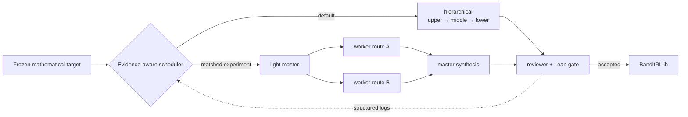
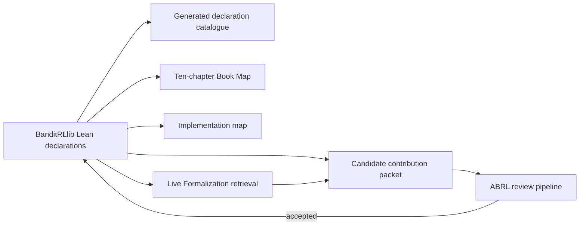
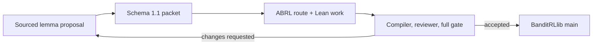

# 🧭 Auto-Bandit-RL-Proof-In-Sleep

## 🧠 A Target-Faithful Automated Theorem Proving System for Bandit and Reinforcement Learning Theory

**Paper:** *ABRL: A Target-Faithful Autoformalization Harness and Lean 4 Library for Bandit and Reinforcement Learning Theory*

**Authors:** Dake Bu · Ji Cheng · Bo Xue · Atsushi Nitanda · Hau-San Wong · Qingfu Zhang

[BanditRLlib website](https://dakebu.github.io/Auto-Bandit-RL-Proof-In-Sleep/) ·
[BanditRLwiki](https://dakebu.github.io/Auto-Bandit-RL-Proof-In-Sleep/banditrlwiki/) ·
[Frontier](https://dakebu.github.io/Auto-Bandit-RL-Proof-In-Sleep/banditrlwiki/frontier/) ·
[Live Formalization](https://dakebu.github.io/Auto-Bandit-RL-Proof-In-Sleep/ide/) ·
[Lean declarations](https://dakebu.github.io/Auto-Bandit-RL-Proof-In-Sleep/declarations/) ·
[How to contribute](CONTRIBUTING.md)

This repository has two connected contributions:

1. **ABRL**, a target-faithful adaptive harness that organizes a mathematical target, retrieval evidence, proof obligations, Lean construction, compiler diagnostics, reviewer feedback, and deterministic acceptance gates; its hierarchical default can now be compared with a bounded master–worker experiment.
2. **BanditRLlib**, the reusable Lean 4 library and literate website produced by accepted ABRL work for bandit and reinforcement-learning theory.

`BanditRLProof` remains the mature internal Lean namespace. **BanditRLlib** is the public library and website name; renaming the namespace would unnecessarily break existing code.

## 📰 News

- **2026-09 — Harness self-comparison.** Structured logs can compare hierarchical and master–worker runs and prepare a bounded GPT diagnosis; zero valid matched pairs means no winner is claimed.
- **2026-09 — Textbook spine.** Ten teaching chapters and Part-IV Chapters 13–17 now link source pages, algorithms, theorem statements, Lean evidence, and named gaps.
- **2026-09 — SGB frontier.** The finite missing-pull regret consumer compiles, while the source phase trigger and Theorem 2 terminal remain open.
- **2026-08 — Lean graph.** The generated graph connects settings, declarations, dependencies, proof routes, and open frontier leaves.
- **2026-08 — Live workspace.** The local experimental adapter retrieves declarations, checks candidates, and exports review packets; Pages is not an online prover.
- **2026-08 — BanditRLlib.** The public Lean library and Blueprint-style teaching/community website were established from accepted ABRL work.

<details>
<summary>Detailed milestone archive</summary>

- **2026-09 — SGB Appendix-C probability dichotomy and missing-pull regret consumer.** Ten declarations split the pure latent `S0/S1` probability exactly into the source-generated all-pulls-present event and an explicit measurable missing-pull event. Four downstream declarations map a missing requested pull, represented by an actual `WithTop.top` coordinate, into a measurable finite-horizon low-count event, transport its probability to the generated trajectory, and charge that existing mass against expected sampled pseudo-regret. They do not supply the source fixed-cutoff trigger, selected IID, positive missing mass, future/no-return, ballot probability, asymptotic assembly, or Theorem 2.
- **2026-09 — SGB Appendix-C phase-event transport.** Fourteen declarations formalize the finite `S0/S1` reward pattern, including the unlucky all-`-1` start, exact recovery terminal sum, and every nonpositive recovery prefix. Separate measurable events keep the all-pulls-present boundary explicit and transport the source generated-process event to the corresponding latent event. The latent event still intersects the adaptive occurrence event, so no product law or occurrence-conditioned IID claim is made; the downstream probability dichotomy now compiles, while its starvation connection, future/no-return, ballot probability, asymptotic assembly, and Theorem 2 remain open.
- **2026-09 — SGB Theorem-2 missing-pull-aware selected-block transport.** Eight indexed declarations package each finite optimal-arm pull time with its stopped reward, identify the block almost surely with a masked latent block, and transport its exact law to both the native stationary process and the source-shaped generated trajectory. `WithTop Nat` keeps absent pulls visible and the mask retains their fallback values, so this is deliberately not a product-law or selected-IID theorem. The all-pulls-present phase event, stopped-prefix future/no-return law, ballot/asymptotic assembly, and Theorem 2 remain open.
- **2026-08 — SGB Theorem-2 native-prefix identification.** Nine new indexed declarations define the native stationary visible trajectory measure, prove its initial and one-step kernel laws, and identify every inclusive finite visible prefix with the corresponding prefix of the latent-coupling visible marginal. This is finite-prefix law equality, not full infinite-trajectory law equality: stopped or pull-ordered selected-reward IID, future-cylinder/no-return, ballot/asymptotic assembly, and Theorem 2 remain blocked. The counted source-audit inventory remains 352 until this separate compiled layer receives its own counted evidence record.
- **2026-08 — SGB Theorem-2 one-step selected-reward freshness.** Eight new indexed declarations aggregate the exact pull-count/arm branch product laws, transport them through the latent trajectory coupling, and consume the pathwise reward readout. The resulting joint and `condDistrib` theorems say that, given the visible history through `n` and the action selected at `n+1`, the actual next reward has exactly that arm's law; the endpoint is also stated on the visible-trajectory marginal. This is deterministic-time conditional freshness, not selected-reward IID. A later nine-declaration layer closes equality with the native process at every finite prefix; full trajectory-law transport, stopped pull-ordered block transport, future-cylinder/no-return, ballot/asymptotic assembly, and Theorem 2 remain blocked.
- **2026-08 — SGB Theorem-2 branch-locality producer.** Twenty-eight new indexed declarations—two reusable restricted-semidirect-product measure bridges and 26 route-specific leaves—extend the preceding 13-declaration action/readout scaffold. A count-capped restricted-measure induction proves `latentArmStreamVisiblePrefixNextActionBranchLocality`, discharging the typed `LatentArmStreamVisiblePrefixNextActionBranchLocality` contract, and an unconditional theorem derives the exact branchwise product law for the selected latent coordinate. Subsequent layers close deterministic-time one-step freshness and equality with the native process at every finite prefix; selected IID, full native visible trajectory-law equality, future-cylinder/no-return, ballot/asymptotic assembly, and Theorem 2 remain blocked.
- **2026-08 — SGB Theorem-2 deferred-decisions prefix factorization.** Eight new indexed declarations prove the exact finite stream-box product law, kernel-law locality of the latent generated trajectory prefix to that box, a Markov visible-prefix kernel, and the exact joint finite stream-box/visible-prefix mixture. This layer alone does not identify its visible marginal with the native fixed-IID SGB prefix. Later branch-locality, aggregation, and native-prefix layers now compile one-step selected-reward freshness and finite-prefix identification; full native visible trajectory-law equality, selected IID, conditional no-return probability, ballot phase, asymptotic assembly, and the Theorem-2 terminal remain blocked.
- **2026-08 — SGB Theorem-2 latent reward product bridge.** Seven indexed declarations prove a fixed arm's finite latent-prefix product law, lift it through the exact stream marginal of the coupled SGB trajectory, specialize it to the optimal arm, and identify every finite nth-pull reward with its corresponding latent coordinate almost surely. Two normalization leaves feed the later finite-prefix factorization. A downstream module now closes finite native-prefix equality, but this work does not make totalized or occurrence-conditioned stopped rewards IID; full native visible trajectory-law equality, the stopped-prefix future cylinder, ballot phase, and polynomial terminal remain blocked.
- **2026-08 — SGB Theorem-2 nth-pull bridge.** Twenty-four new declarations define the zero-based optimal-arm nth-pull time on the chronological generated trajectory with an explicit `WithTop Nat` missing-pull value. The compiled layer proves stopping-time and measurability boundaries, exact finite before/action/after count semantics, and measurable stopped reward and post-pull probability at the same coordinate. It does not prove adaptive selected-reward IID, the conditional no-return probability, the Rademacher/ballot phase, or the polynomial-regret terminal; Theorem 2 remains blocked.
- **2026-08 — Delayed-SAPO source audit reaches two numerical producers.** The source-frozen NeurIPS 2025 audit now compiles 197 named source-audit declarations. A six-declaration Appendix-D.11 leaf formalizes the Markov/counting step on the nonnegative stochastic loss-gap domain; the unrestricted real-valued formulation is not promoted, and a signed regression canary guards that premise boundary. A separate 31-declaration Algorithm-5 line-10 leaf initializes exactly the newly eliminated arms with the source probability, frozen processed state, surrogate gap, and first EAP phase target; a concrete two-arm canary checks elimination, preservation, positivity, and the exact `p_i^1 = 1/2` fixture. Lemma D.13, EAP/BSC transitions, the generated delayed process, D.4, and Theorems 4.1/5.1 remain uncompiled.
- **2026-08 — BanditRLwiki and assumption-indexed frontier.** The website now compares 13 upper/lower-bound cases across seven finite-bandit, adversarial, linear/contextual, finite-horizon RL, delayed/nonstationary, pure-exploration, and distributional-lower-bound families. Every case fixes its assumptions and regret criterion, separates 19 primary-paper titles from 27 indexed theorem surfaces, and reports literature optimality, source-audit fidelity, and local Lean evidence independently. The separate Frontier distinguishes audited literature-open cases (currently none), one source-audit queue item, and 39 named formalization leaves across 13 open cases; it also surfaces the 54-declaration succinct-lower-bound and 352-declaration stochastic-gradient-bandit audits in a separate source-frozen lane. The SGB lane contains one exact compiled paper endpoint plus conservative partial infrastructure for Theorem 2 and a bounded Theorem-4 source-contract diagnosis, but remains outside the matched-bound comparison atlas; the succinct and delayed audits remain partial. The setting → case → frontier organization is design inspiration from Samplinglib's public SampleWiki/Frontier; BanditRLlib's data, generator, pages, styles, and interaction code are independently implemented.
- **2026-08 — Third source-frozen external theorem audit closes SGB Theorem 1.** The Baudry--Johnson--Vary--Pike-Burke--Rebeschini NeurIPS 2025 stochastic-gradient-bandit audit now compiles 215 named declarations in twelve evidence layers, the previous `26+18+18+14+4+10+3+25+19+9+37` route plus a 32-declaration terminal layer. The new layer closes the generated Equation-(5) conditional-expectation tower, exact expected-parameter telescope, forward-potential Jensen/log bound, actual sampled-action pseudo-regret bridge, Equation-(7) assembly, and `twoArmFixedIIDDirac_theoremOne`. The endpoint matches source Theorem 1 for bounded two-arm fixed-IID reward laws, exact means and gap, `0 < Delta < 1`, `0 < eta`, `eta * C_eta < Delta`, and source horizon `T = tailHorizon + 1`. `Dirac` refers to the `Unit` environment prior, not the reward laws. The paper audit remains partial: Theorems 2--4, general-`K`, and the remaining learning-rate regimes are uncompiled.
- **2026-08 — SGB Appendix-E source-contract gate.** Eight additional declarations compile the positive Theorem-4 drift margin, an audited finite survival-event lower bound under explicit premises, and the finite geometric transient-phase envelope.  They expose an unresolved Step-4 direction/conditioning mismatch and leave the generated general-`K` process, uniform buffer/survival producer, stopped supermartingale, and Theorem 4 explicitly uncompiled.  The SGB audit inventory is now 223 declarations: the exact 215-declaration Theorem-1 stack plus this bounded 8-declaration gate.
- **2026-08 — Second source-frozen external theorem audit.** The Zeng--Honorio NeurIPS 2025 succinct stochastic-bandit audit compiles 54 named declarations for the symmetric unit-atom system, the literal succinct-support contract, the source-shaped `Q` and `R`, Definitions 3.1--3.3, and Lemmas 3.1--3.4. The audit now records two source-contract blockers rather than silently strengthening the theorem: real-valued global `R` is unsound for unbounded non-spanning systems in the current totalized `sSup` semantics, and printed Theorem 3.8 omits sample-size conditions used by its proof. The global Lemmas 3.5--3.6, Assumption 3.7, Theorem 3.8, and regret endpoints remain uncompiled pending an explicit corrected contract.
- **2026-09 — Chapter 14 information-theory extension.** The local layer compiles Huffman global optimality and its entropy sandwich, finite uniquely-decodable/prefix-code equivalence including Kraft equality, exact-real arithmetic block coding and its entropy-rate converse, finite-alphabet KL with exact support endpoints, finite-discretisation/RN equivalence, common-density and source affinity/overlap bounds, Gaussian testing, and full sub-sigma-algebra data processing. Event DPI and unconditional Bretagnolle--Huber remain intact. Coding uses nonempty words and classical exact-real constructions; arbitrary-cardinality uniform fixed-length optimality is explicitly qualified, not asserted. Whole-chapter status stays `partial` pending current-main integration and remote evidence; independent source review accepted the arbitrary-event repair; optional notes/exercises and Chapter 15 history KL are not claimed as Chapter 14 completion.
- **2026-08 — Part IV Chapters 13--17 lower-bound spine.** The separate source-faithful textbook layer compiles Chapter 13 minimax semantics, least-explored-arm and error-bearing two-environment algebra; Chapter 14 extended-real relative entropy, event-level binary data processing, endpoint-complete testing, and unconditional Bretagnolle--Huber; and Chapter 15's general finite-arm, same-randomized-policy history KL decomposition (Lemma 15.1) together with the exact unit-Gaussian Theorem 15.2 existence and minimax chain, including the `1/27` constant. This also yields Chapter 13's source-order statement with explicit universal constant `1/54`. Chapter 16 now compiles exact consistency/`d_inf` interfaces, the unit-Gaussian Table 16.1 equality, subpolynomial power/log-growth dependencies, the one-arm same-policy history-KL/majority-event information layer, canonical gap-times-pull-count expected pseudo-regret, both exact majority-event charges, and a factor-`1/4` finite-KL logarithmic consumer for explicit gap vectors. The finite arm-law mean-to-gap identification and Theorem 16.2/Lemma 16.3/Theorem 16.4 remain blocked. Chapter 17's threshold surfaces, Claim 17.5 first-moment witness, event subtraction, and deterministic Eq. (17.8) quarter-horizon algebra compile while its tail terminals remain blocked. Chapter 15's optional notes/exercises are not claimed complete, and compiled dependencies are never reported as later Chapter 16--17 source terminals.
- **2026-08 — Book Map Chapter 9 canonical Hoeffding UCBVI-CH completion.** One strict-prefix recurrent generated source now connects aggregate transition counts, previous-Q clipping, same-law confidence, Bellman optimism, raw cumulative policy-value pseudo-regret, actual-count charge summation, and a generated-filtration innovation tail. The public terminal has the frozen `20/250` high-probability bound, and its integrable expectation consumer retains `K H delta`; GitHub Actions and the Pages deployment were verified before promotion. Bernstein/minimax, stochastic-reward, and realized sampled-return UCBVI remain separate extensions.
- **2026-08 — Book Map Chapters 7--8 canonical completion.** A six-group public typed canary now verifies the scoped canonical generated EXP3 and half-Tsallis FTRL routes. EXP3 keeps the horizon-tuned expected/fixed-window laws distinct from the fixed-process all-positive-prefix theorem; Tsallis reaches a concrete bounded IID reward-law logarithmic terminal. Horizon-free tuned EXP3, paper-sharp/minimax Tsallis-INF, complete best-of-both-worlds guarantees, and observed-reward restart detection remain explicit extensions.
- **2026-08 — Book Map Chapters 5--6 canonical completion.** The public typed canary now verifies the scoped finite-action OFUL chain (including one horizon-free all-time/all-horizon/stopping policy) and the stationary generated Thompson chain (including an explicit mean-optimal selector contract and the concrete Bayesian-regret endpoint). Expected OFUL consistency is correctly identified as a separate horizon-indexed family; contextual/dynamic linear bandits, broader Thompson models, sharp constants, and direct LeanMachineLearning identity remain outside the promotion.
- **2026-08 — Verified frontier refresh.** The public Book Map records the compiled fixed-policy telescoping anytime-UCB route, a conservative bounded generated KL-UCB route, and the same-process all-positive-prefix EXP3 chain. Its then-partial adaptive cumulative UCB-VI layer is superseded by the Chapter 9 canonical completion above; sharp KL-Chernoff/asymptotic KL-UCB results and direct LeanMachineLearning toolchain identity remain explicitly unproved or blocked.
- **2026-08 — BanditRLlib public community site.** The Blueprint-style site now presents the complete indexed Lean formalization, ten teaching chapters, plain-English theorem explanations, an implementation map, proof dependencies, progress, and contribution routes.
- **2026-08 — Live Formalization preview.** A provider-independent, retrieval-grounded local adapter can turn LaTeX or natural language into an explicitly unverified Lean candidate, compile it in a temporary file, and export a review packet. Semantic fidelity, compilation, proof completion, and library integration remain separate statuses.
- **2026-08 — Canonical publication line.** This repository's `main` branch and GitHub Pages workflow are the single maintained public source.

</details>

## 🔗 ABRL and BanditRLlib



The hierarchy protects the intended theorem and decomposes proof leaves. The experimental master–worker arm explores only disjoint, frozen routes in parallel. A matched comparison gives both arms the same hashed route packet, and only a separate reviewer verdict can classify an execution as evidence. GPT may produce a hash-bound advisory and candidate Mermaid architecture from that ledger, but it cannot promote an attempt or select a winner against the deterministic gate. A result enters BanditRLlib only after the full gate. Current historical logs cannot establish which arm is better, so the default has not been changed.



The website is therefore not only API documentation. It serves three audiences:

- students learning bandit/RL mathematics beside verified Lean;
- researchers locating exact declarations, assumptions, files, and dependencies;
- contributors proposing new lemmas through a reviewable, machine-readable route.

## 🌐 BanditRLlib website

<details>
<summary>Website features and local build</summary>

The public site provides:

- an accessible project overview and recommended reading path;
- BanditRLwiki, with 13 assumption-compatible upper/lower comparisons, stable
  case pages, a primary-paper index, independent literature/source/Lean status,
  audit progress, and explicit frontier leaves;
- a sidebar Book Map with ten mathematical chapters;
- a separate source-faithful Textbook Spine for Part IV, Chapters 13--17, with per-chapter status and page mapping;
- an exhaustive generated declaration catalogue;
- natural-language statements, notation, intuition, proof sketches, and Lean correspondence for selected major interfaces;
- an implementation map distinguishing compiled, partial, stated, planned, and blocked work;
- architecture, dependency, learning-path, progress, installation, formalization, and contribution diagrams;
- installation, contributor, governance, attribution, roadmap, and source-access pages.

Build and inspect it locally:

```text
python website/scripts/build_site.py --lean-verified
python website/scripts/check_site.py
python -m http.server 8000 --directory website/_site
```

Then open `http://localhost:8000/`.

</details>

## 🧪 Live Formalization

<details>
<summary>Local experimental workspace and status boundaries</summary>

The static page previews LaTeX, navigates reviewed mappings, draws dependency trees, and exports draft packets. Local compilation and candidate generation use a loopback-only companion:

```text
python website/scripts/ide_server.py --port 8000
```

Optional model-provider configuration stays on the server:

```text
ABRL_FORMALIZER_PROVIDER=json-http
ABRL_FORMALIZER_ENDPOINT=https://your-provider.example/v1/formalize
ABRL_FORMALIZER_API_KEY=your-server-side-secret
```

The browser never receives the API key. The adapter retrieves current BanditRLlib declarations plus Mathlib and LML theorem cards before requesting a candidate. Without a configured provider it reports formalization as unavailable; it does not fabricate a translation.

A candidate can have four independent statuses:

- translation: candidate or semantically reviewed;
- Lean: not checked, compiles, or rejected;
- proof: unproved or compiled;
- library: proposed or integrated.

Compilation alone never means that LaTeX and Lean have the same mathematical meaning.

</details>

## 🚀 Quick start

<details>
<summary>Installation, checks, commands, and repository map</summary>

Prerequisites: Git, Python 3, and [Elan](https://lean-lang.org/install/). The repository pins the Lean toolchain and Mathlib revision.

```text
git clone https://github.com/DakeBU/Auto-Bandit-RL-Proof-In-Sleep.git
cd Auto-Bandit-RL-Proof-In-Sleep
lake update
python tools/bandit.py check
```

The mandatory check builds the library, builds `Tests`, scans for forbidden placeholders, refreshes generated indexes, and validates the synchronized proof artifacts.

Useful read-only commands:

```text
python tools/bandit.py frontier-shadow
python tools/bandit.py list-lean-decls
python tools/bandit.py list-lean-decls Exp3 --statement
python tools/bandit.py route-plan BRL-UCB-PORT-001
python tools/validate_target_drift_suite.py
python tools/validate_target_drift_suite_v2.py
python tools/validate_target_drift_external_comparator.py
```

Core paths:

- `BanditRLProof/` — Lean modules;
- `Tests/` — import and theorem smoke tests;
- `tasks/` and `proof-obligations/` — target and leaf contracts;
- `proof-blueprints/` — proof-graph snapshots;
- `research-wiki/` — source-aware theorem cards and retrieval indexes;
- `runs/` — attempt, lifecycle, and acceptance evidence;
- `evaluation/target-drift-v1/` — frozen initial 30-case authoring bank; retained
  unchanged for provenance, but superseded for execution by v2;
- `evaluation/target-drift-v2/` — balanced faithful/drift protocol, pre-audit
  condition views, matched field/value wording with a text-only leakage audit,
  content-addressed seal, frozen adapter contract plus sealed entrypoint,
  absolute host-runtime bytes, and a result-free Codex CLI adapter candidate
  that hash-binds and rechecks the separately invoked Codex CLI client, translates raw JSONL,
  preserves observable task/thread identity without calling it a provider
  request, accounts for cache-read/cache-write/reasoning token categories, and
  recomputes cost from frozen dated rates. The remote model version remains a
  provider/operator attestation rather than a claim derived from JSONL. The
  candidate disables nonexperimental web/MCP/plugin/collaboration surfaces,
  copies one auth file into a fresh disposable `CODEX_HOME` plus a frozen shell-environment
  allowlist, and deliberately launches no automatic second CLI invocation, so
  an unobserved failed attempt cannot be relabeled as zero-cost evidence. Any
  provider-client-internal retry remains outside the observable adapter trace.
  This candidate is
  component-tested but is not a production
  agent sandbox.  The sanitized outer-controller/
  canonical-Docker-launcher/trusted-controller/restricted-worker sandbox
  contract, non-executing in-image checker/cache-manifest verification, fresh replay,
  an atomic operator grading pack, a physically separate positive-allowlist
  grader export, workflow-artifact hash records, and source/target-aware
  analysis with secondary multiplicity control, plus an exact 450-ID completion
  ledger that forbids replacement and imputation and suppresses every inferential
  result whenever any prospectively specified run is missing.  The grader export
  contains only normalized packets, the frozen prompt and rubric, a response
  template, and a digest manifest; exact-tree verification excludes the internal
  mapping, completion ledger, and execution/workflow metadata.  Before export or
  grade assembly, the internal pack is reconstructed byte for byte from the
  sealed run manifest and current checked-run evidence.  Before inference, the
  analyzer reruns the hash-matched sealed assembler from the two grader responses
  and adjudication and requires the rebuilt grade ledger to match exactly.  A provenance-bound multi-stage
  builder now exports the exact common pre-audit Git snapshot, constructs and
  byte-manifests the complete Lake cache, keeps that source out of the final
  image, and can emit an image/toolchain/cache SBOM only after the final image
  runs the pinned Lean/Lake release offline as the restricted worker.  Component
  tests pass, but no test executes the full
  real-provider-to-grading chain.  The deterministic fake adapter and fail-closed
  probes are nonexperimental fixtures.  A first result-free Linux CI candidate build
  ([run 32137509103](https://github.com/DakeBU/Auto-Bandit-RL-Proof-In-Sleep/actions/runs/32137509103))
  constructed an unpublished cache-complete image from the frozen base snapshot
  and a digest-pinned Lean base, then emitted hash-bound build-input, cache,
  log, and SBOM evidence after an offline Lean 4.29.1 / Lake
  5.0.0-src+f72c35b worker probe.  The
  candidate was ephemeral and is not the frozen production image.  A later
  result-free candidate build and isolation run
  ([run 32419343467](https://github.com/DakeBU/Auto-Bandit-RL-Proof-In-Sleep/actions/runs/32419343467))
  bound one unpublished image to the exact Docker runtime and passed all seven
  candidate probes, including `CapEff=0`, protected inputs/outputs, and
  cid/label cleanup; its evidence is recorded in
  `evaluation/target-drift-v2/checker-image-candidate-32419343467.json`.
  That ephemeral candidate result is not a published production checker, a
  production agent sandbox, or a final experiment seal.  A frozen real provider
  image, final published and sealed checker image, budgets, graders, final seal, the prospectively specified
  one-case-by-three-condition real-infrastructure smoke, and all 450 primary
  model runs remain unstarted.  The smoke now has a separate hash-bound
  materializer/runner: it derives one matched three-condition block, hides the
  smoke purpose from the agent request, and forces even a production-checker
  success to `checked_smoke_nonexperimental` with `result_eligible=false`, so it
  cannot enter blind grading or the primary analysis.  This lane is implemented
  and component-tested but has not been run.  A separate result-free Linux
  lifecycle candidate
  ([run 32436339541](https://github.com/DakeBU/Auto-Bandit-RL-Proof-In-Sleep/actions/runs/32436339541))
  bound an ephemeral image, Docker runtime, PID-1 controller, and exact command,
  then observed a setsid descendant heartbeat increase before abrupt host-client
  loss and freeze after the PID namespace disappeared.  Its evidence is recorded
  in `evaluation/target-drift-v2/agent-lifecycle-candidate-32436339541.json`.
  This closes only that generic lifecycle-component check.  A later combined
  result-free agent-image run
  ([run 32464814750](https://github.com/DakeBU/Auto-Bandit-RL-Proof-In-Sleep/actions/runs/32464814750))
  layered the exact SRI/SHA-512-locked Linux Codex
  `0.130.0` client, bundled `bwrap`/`rg`, adapter, and PID-1 controller onto the
  cache-complete Lean image.  On the exact unpublished digest it passed
  byte/toolchain checks, workspace-write and persistent-outside-write boundaries,
  AppArmor profile inheritance, outer credential-sentinel unreadability, an
  outer-reachable/inner-`EPERM` same-IPv4 network check, and the destructive
  PID-1 lifecycle probe.  All 23 downloaded artifact bytes and hashes, plus the
  available report/SBOM/cache/runtime/source/lifecycle cross-file bindings,
  were independently recomputed; the public record is
  `evaluation/target-drift-v2/agent-image-candidate-32464814750.json`.  This is
  result-free candidate evidence, not a production agent sandbox or experiment
  result.  The source tree now also contains a canonical, result-free-only
  outer-launcher candidate: it runs the exact local digest with a root PID-1
  control plane, fixed AppArmor/resource/capability policy, one read-only fake
  `auth.json`, a read-only agent input, disposable non-root tmpfs workspace and
  `CODEX_HOME`, and root-only persistent control output.  Its offline probe
  checks a one-time root-open, read-only fake-auth descriptor handoff that is
  consumed and closed before the nested command sandbox starts; the nested
  shell must still receive a real permission denial on the existing auth mount.
  This is not the real Codex provider-auth path.  A result-free Linux run
  ([run 32735680163](https://github.com/DakeBU/Auto-Bandit-RL-Proof-In-Sleep/actions/runs/32735680163))
  exercised this fake-only component on the same unpublished digest as its
  offline-isolation and destructive-lifecycle probes.  Independent review of
  the 29-file artifact found exactly the four expected root-control files,
  `EACCES` on the existing auth and control paths, zero worker and nested
  effective capabilities, and no broker environment marker or auth-targeting
  descriptor.  The durable metadata is recorded in
  `evaluation/target-drift-v2/agent-outer-boundary-candidate-32735680163.json`.
  The same source boundary now also has a production-shaped
  `--component-mode excluded-execute` path.  A tracked request and invocation
  contract bind a provider-disabled, zero-budget, result-ineligible adapter
  call inside the PID-1 image; controller and host validators require the exact
  fake-auth handoff, Docker network `none`, zero token/tool/build/cost trace,
  fixed five-file output, and clean child exit.  It imports no provider/network/
  subprocess client, performs no Lean build, and cannot enter the smoke or
  450-run ledgers.  No real credential or remote model is used, and the primary
  evaluation remains `execution_not_started`.  A reviewed production
  execution/authentication path, remote-model attestation, prices,
  active-budget boundary, final images and resealed probes, final seal, and
  real smoke remain separate gates.  The real smoke and all 450 model runs
  remain unstarted; no model or formalization outcome is reported;
  `evaluation/target-drift-v2/external-comparator-plan.json` independently pins
  LeanFlow as a current public end-to-end comparator and specifies a 30-run
  descriptive calibration after its own result-ineligible smoke.  It leaves the
  three-condition primary estimand and 450-run design unchanged while binding
  the current pre-outcome, integrity-amended protocol bytes; an adjacent seal
  binds both files by SHA-256.  The comparator calibration is
  planned and unrun, so it supports no numerical or superiority claim;
- `website/` — literate static site, BanditRLwiki, progressive chapter → module → declaration Lean Graph, local compiler service, and integrity checker;
- `tools/bandit.py` — deterministic harness CLI.
- [`docs/proof_graph_laboratory.md`](docs/proof_graph_laboratory.md) — compiled-environment dependency export, proof-cost/ZDD/hypergraph prototypes, and the proof-structural novelty audit boundary.

</details>

## 🤝 Contributing

Start with [CONTRIBUTING.md](CONTRIBUTING.md) and open a lemma proposal before a large proof. A useful proposal includes the source, exact assumptions, mathematical statement, intended namespace/module, likely dependencies, and known missing steps.



Contribution credit records the specific accepted work. It does not automatically imply authorship of the ABRL paper. See [GOVERNANCE.md](GOVERNANCE.md) and [CODE_OF_CONDUCT.md](CODE_OF_CONDUCT.md).

## 🧬 Related work and design lineage

| Project | Relevant idea | Relationship here |
|---|---|---|
| [Mathlib][mathlib] | Broad, reviewed Lean mathematics | Primary external proof foundation |
| [LeanMachineLearning/LML][lml] | Machine-learning theorem cards and formalization | Retrieval source; cards are not treated as local compiled declarations |
| [lean-stat-learning-theory][lean-stat] | Formalized statistical learning theory | Adjacent formalization reference |
| [LeanMarathon][leanmarathon] | Proof blueprints and deterministic proof gates | Inspiration for inspectable proof-leaf workflows |
| [ABEIS][abeis] | Hierarchical proof harness | Inspiration for ABRL upper/middle/lower/reviewer organization |
| [ARIS][aris] | Plain-file autonomous research workflow | Inspiration for inspectable tasks, reviews, and run logs |
| [StatsMLlib][statsmllib] | Open statistical ML library and teaching navigation | Inspiration for the community-facing sidebar and Book Map |
| [Samplinglib Lean Graph][samplinglib-graph] and [SampleWiki][samplinglib-wiki] | Interactive formal-library topology and setting-to-frontier atlas | Design inspiration only; BanditRLlib independently implements the graph, theorem data, generator, styles, and interaction code |

The Blueprint website design and organization were inspired by **Sho Sonoda's** [Lean-Ridgelet repository](https://github.com/shosonoda/lean-ridgelet) and [Blueprint website](https://shosonoda.github.io/lean-ridgelet/blueprint/html-multi/overview/). See [NOTICE](NOTICE.md) and [docs/attribution.md](docs/attribution.md). This attribution does not imply Sho Sonoda's participation, endorsement, or maintenance of this project.

## 📚 Citation

```bibtex
@software{bu2026abrl,
  title  = {ABRL: A Target-Faithful Autoformalization Harness and Lean 4 Library for Bandit and Reinforcement Learning Theory},
  author = {Bu, Dake and Cheng, Ji and Xue, Bo and Nitanda, Atsushi and Wong, Hau-San and Zhang, Qingfu},
  year   = {2026},
  url    = {https://github.com/DakeBU/Auto-Bandit-RL-Proof-In-Sleep}
}
```

## ⚖️ License

Repository code and documentation are governed by [LICENSE](LICENSE). Third-party inspiration and any reused material are recorded in [NOTICE](NOTICE.md) and [docs/attribution.md](docs/attribution.md).

[abeis]: https://github.com/DakeBU/Automated-Block-Encoding-In-Sleep
[aris]: https://github.com/DakeBU/Automated-Research-In-Sleep
[leanmarathon]: https://github.com/YuanheZ/LeanMarathon
[lml]: https://github.com/leanprover-community/LeanMachineLearning
[lean-stat]: https://github.com/leanprover-community/lean-stat-learning-theory
[mathlib]: https://github.com/leanprover-community/mathlib4
[statsmllib]: https://statsmllib.github.io/
[samplinglib-graph]: https://dakebu.github.io/Auto-Sampling-Theory-In-Sleep/lean-foundations.html
[samplinglib-wiki]: https://dakebu.github.io/Auto-Sampling-Theory-In-Sleep/example-cases/samplewiki.html
