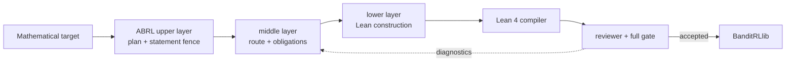
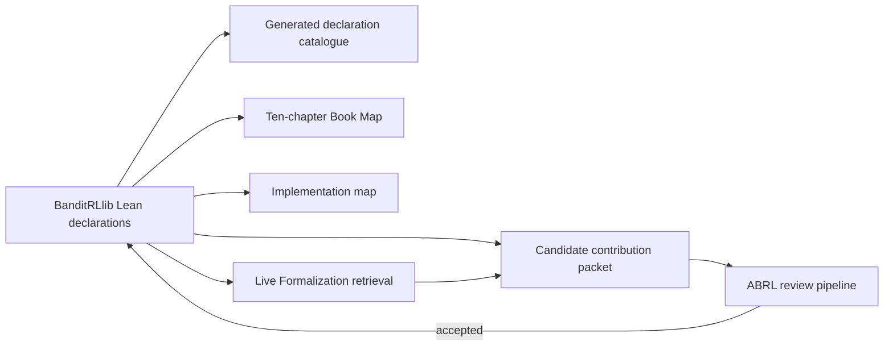
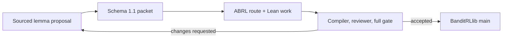

# 🧭 Auto-Bandit-RL-Proof-In-Sleep

## 🧠 A Hierarchical Automated Theorem Proving System for Bandit and Reinforcement Learning Theory

**Paper:** *ABRL: A Target-Faithful Autoformalization Harness and Lean 4 Library for Bandit and Reinforcement Learning Theory*

**Authors:** Dake Bu · Ji Cheng · Bo Xue · Atsushi Nitanda · Hau-San Wong · Qingfu Zhang

[BanditRLlib website](https://dakebu.github.io/Auto-Bandit-RL-Proof-In-Sleep/) ·
[Live Formalization](https://dakebu.github.io/Auto-Bandit-RL-Proof-In-Sleep/ide/) ·
[Lean declarations](https://dakebu.github.io/Auto-Bandit-RL-Proof-In-Sleep/declarations/) ·
[How to contribute](CONTRIBUTING.md)

This repository has two connected contributions:

1. **ABRL**, a target-faithful hierarchical harness that organizes a mathematical target, retrieval evidence, proof obligations, Lean construction, compiler diagnostics, reviewer feedback, and deterministic acceptance gates.
2. **BanditRLlib**, the reusable Lean 4 library and literate website produced by accepted ABRL work for bandit and reinforcement-learning theory.

`BanditRLProof` remains the mature internal Lean namespace. **BanditRLlib** is the public library and website name; renaming the namespace would unnecessarily break existing code.

## 📰 News

- **2026-08 — Third source-frozen external theorem audit.** The Baudry--Johnson--Vary--Pike-Burke--Rebeschini NeurIPS 2025 stochastic-gradient-bandit audit now compiles 44 named declarations: 26 for the finite-action algebra underlying Algorithm 1 and Equations (3)--(7), plus 18 for the recursive parameter state, its measurable softmax history policy, a canonical generated action/reward trajectory, initial and successor conditional laws, and Equation-(5) history-step-kernel integrals under explicit coordinate-update integrability and arm-reward integral equalities. This process bridge does not produce those hypotheses from the paper's source-specific reward regularity, or prove its learning-rate thresholds, failure-probability estimates, or Theorems 1--4; the audit remains partial.
- **2026-08 — Second source-frozen external theorem audit.** The Zeng--Honorio NeurIPS 2025 succinct stochastic-bandit audit now compiles 54 named declarations for the symmetric unit-atom system, the literal succinct-support contract, the source-shaped `Q` and `R`, Definitions 3.1--3.3, and Lemmas 3.1--3.4. For the same vector, the new finite-Bessel route proves that a strict succinct representation has no more atoms than any succinct representation, and that two strict representation sizes agree. A compiled diagnostic separately shows that the globally real-valued `R` candidate set is unbounded when a nonzero ambient vector is orthogonal to every atom. This records a regularity/codomain obligation rather than declaring the source incorrect; the global Lemmas 3.5--3.6, Assumption 3.7, Theorem 3.8, and its regret endpoints remain uncompiled.
- **2026-08 — Part IV Chapters 13--17 lower-bound spine.** The separate source-faithful textbook layer compiles Chapter 13 minimax semantics, least-explored-arm and error-bearing two-environment algebra; Chapter 14 extended-real relative entropy, event-level binary data processing, endpoint-complete testing, and unconditional Bretagnolle--Huber; and Chapter 15's general finite-arm, same-randomized-policy history KL decomposition (Lemma 15.1) together with the exact unit-Gaussian Theorem 15.2 existence and minimax chain, including the `1/27` constant. This also yields Chapter 13's source-order statement with explicit universal constant `1/54`. Chapter 16 now compiles exact consistency/`d_inf` interfaces, the unit-Gaussian Table 16.1 equality, subpolynomial power/log-growth dependencies, and the one-arm same-policy history-KL/majority-event information plus scalar log assembly; its source-general event-to-regret producers and Theorem 16.2/Lemma 16.3/Theorem 16.4 remain blocked. Chapter 17's threshold surfaces, Claim 17.5 first-moment witness, event subtraction, and deterministic Eq. (17.8) quarter-horizon algebra compile while its tail terminals remain blocked. Chapter 15's optional notes/exercises are not claimed complete, and compiled dependencies are never reported as later Chapter 16--17 source terminals.
- **2026-08 — Book Map Chapter 9 canonical Hoeffding UCBVI-CH completion.** One strict-prefix recurrent generated source now connects aggregate transition counts, previous-Q clipping, same-law confidence, Bellman optimism, raw cumulative policy-value pseudo-regret, actual-count charge summation, and a generated-filtration innovation tail. The public terminal has the frozen `20/250` high-probability bound, and its integrable expectation consumer retains `K H delta`; GitHub Actions and the Pages deployment were verified before promotion. Bernstein/minimax, stochastic-reward, and realized sampled-return UCBVI remain separate extensions.
- **2026-08 — Book Map Chapters 7--8 canonical completion.** A six-group public typed canary now verifies the scoped canonical generated EXP3 and half-Tsallis FTRL routes. EXP3 keeps the horizon-tuned expected/fixed-window laws distinct from the fixed-process all-positive-prefix theorem; Tsallis reaches a concrete bounded IID reward-law logarithmic terminal. Horizon-free tuned EXP3, paper-sharp/minimax Tsallis-INF, complete best-of-both-worlds guarantees, and observed-reward restart detection remain explicit extensions.
- **2026-08 — Book Map Chapters 5--6 canonical completion.** The public typed canary now verifies the scoped finite-action OFUL chain (including one horizon-free all-time/all-horizon/stopping policy) and the stationary generated Thompson chain (including an explicit mean-optimal selector contract and the concrete Bayesian-regret endpoint). Expected OFUL consistency is correctly identified as a separate horizon-indexed family; contextual/dynamic linear bandits, broader Thompson models, sharp constants, and direct LeanMachineLearning identity remain outside the promotion.
- **2026-08 — Verified frontier refresh.** The public Book Map records the compiled fixed-policy telescoping anytime-UCB route, a conservative bounded generated KL-UCB route, and the same-process all-positive-prefix EXP3 chain. Its then-partial adaptive cumulative UCB-VI layer is superseded by the Chapter 9 canonical completion above; sharp KL-Chernoff/asymptotic KL-UCB results and direct LeanMachineLearning toolchain identity remain explicitly unproved or blocked.
- **2026-08 — BanditRLlib public community site.** The Blueprint-style site now presents the complete indexed Lean formalization, ten teaching chapters, plain-English theorem explanations, an implementation map, proof dependencies, progress, and contribution routes.
- **2026-08 — Live Formalization preview.** A provider-independent, retrieval-grounded local adapter can turn LaTeX or natural language into an explicitly unverified Lean candidate, compile it in a temporary file, and export a review packet. Semantic fidelity, compilation, proof completion, and library integration remain separate statuses.
- **2026-08 — Canonical publication line.** This repository's `main` branch and GitHub Pages workflow are the single maintained public source.

## 🔗 ABRL and BanditRLlib



The upper layer protects the intended theorem. The middle layer chooses reusable routes and explicit proof leaves. The lower layer changes Lean code. The reviewer compares the compiled declaration with the fenced target and recorded evidence. A result enters BanditRLlib only after the full gate passes.



The website is therefore not only API documentation. It serves three audiences:

- students learning bandit/RL mathematics beside verified Lean;
- researchers locating exact declarations, assumptions, files, and dependencies;
- contributors proposing new lemmas through a reviewable, machine-readable route.

## 🌐 BanditRLlib website

The public site provides:

- an accessible project overview and recommended reading path;
- a sidebar Book Map with ten mathematical chapters;
- a separate source-faithful Textbook Spine for Part IV, Chapters 13--17, with per-chapter status and page mapping;
- an exhaustive generated declaration catalogue;
- natural-language statements, notation, intuition, proof sketches, and Lean correspondence for selected major interfaces;
- an implementation map distinguishing compiled, partial, stated, planned, and blocked work;
- architecture, dependency, learning-path, progress, installation, formalization, and contribution diagrams;
- installation, contributor, governance, attribution, roadmap, and source-access pages.

Build and inspect it locally:

```text
python website/scripts/build_site.py --lean-verified
python website/scripts/check_site.py
python -m http.server 8000 --directory website/_site
```

Then open `http://localhost:8000/`.

## 🧪 Live Formalization

The static page previews LaTeX, navigates reviewed mappings, draws dependency trees, and exports draft packets. Local compilation and candidate generation use a loopback-only companion:

```text
python website/scripts/ide_server.py --port 8000
```

Optional model-provider configuration stays on the server:

```text
ABRL_FORMALIZER_PROVIDER=json-http
ABRL_FORMALIZER_ENDPOINT=https://your-provider.example/v1/formalize
ABRL_FORMALIZER_API_KEY=your-server-side-secret
```

The browser never receives the API key. The adapter retrieves current BanditRLlib declarations plus Mathlib and LML theorem cards before requesting a candidate. Without a configured provider it reports formalization as unavailable; it does not fabricate a translation.

A candidate can have four independent statuses:

- translation: candidate or semantically reviewed;
- Lean: not checked, compiles, or rejected;
- proof: unproved or compiled;
- library: proposed or integrated.

Compilation alone never means that LaTeX and Lean have the same mathematical meaning.

## 🚀 Quick start

Prerequisites: Git, Python 3, and [Elan](https://lean-lang.org/install/). The repository pins the Lean toolchain and Mathlib revision.

```text
git clone https://github.com/DakeBU/Auto-Bandit-RL-Proof-In-Sleep.git
cd Auto-Bandit-RL-Proof-In-Sleep
lake update
python tools/bandit.py check
```

The mandatory check builds the library, builds `Tests`, scans for forbidden placeholders, refreshes generated indexes, and validates the synchronized proof artifacts.

Useful read-only commands:

```text
python tools/bandit.py frontier-shadow
python tools/bandit.py list-lean-decls
python tools/bandit.py list-lean-decls Exp3 --statement
python tools/bandit.py route-plan BRL-UCB-PORT-001
python tools/validate_target_drift_suite.py
python tools/validate_target_drift_suite_v2.py
```

Core paths:

- `BanditRLProof/` — Lean modules;
- `Tests/` — import and theorem smoke tests;
- `tasks/` and `proof-obligations/` — target and leaf contracts;
- `proof-blueprints/` — proof-graph snapshots;
- `research-wiki/` — source-aware theorem cards and retrieval indexes;
- `runs/` — attempt, lifecycle, and acceptance evidence;
- `evaluation/target-drift-v1/` — frozen initial 30-case authoring bank; retained
  unchanged for provenance, but superseded for execution by v2;
- `evaluation/target-drift-v2/` — balanced faithful/drift protocol, pre-audit
  condition views, matched field/value wording with a text-only leakage audit,
  content-addressed seal, frozen adapter contract plus sealed entrypoint,
  absolute host-runtime bytes, and a result-free Codex CLI adapter candidate
  that hash-binds and rechecks the separately invoked Codex CLI client, translates raw JSONL,
  preserves observable task/thread identity without calling it a provider
  request, accounts for cache-read/cache-write/reasoning token categories, and
  recomputes cost from frozen dated rates. The remote model version remains a
  provider/operator attestation rather than a claim derived from JSONL. The
  candidate disables nonexperimental web/MCP/plugin/collaboration surfaces,
  copies one auth file into a fresh disposable `CODEX_HOME` plus a frozen shell-environment
  allowlist, and deliberately launches no automatic second CLI invocation, so
  an unobserved failed attempt cannot be relabeled as zero-cost evidence. Any
  provider-client-internal retry remains outside the observable adapter trace.
  This candidate is
  component-tested but is not a production
  agent sandbox.  The sanitized outer-controller/
  canonical-Docker-launcher/trusted-controller/restricted-worker sandbox
  contract, non-executing in-image checker/cache-manifest verification, fresh replay,
  blind grading packets, workflow-artifact hash records, and source/target-aware
  analysis with secondary multiplicity control, plus an exact 450-ID completion
  ledger that forbids replacement and imputation and suppresses every inferential
  result whenever any preregistered run is missing.  A provenance-bound multi-stage
  builder now exports the exact common pre-audit Git snapshot, constructs and
  byte-manifests the complete Lake cache, keeps that source out of the final
  image, and can emit an image/toolchain/cache SBOM only after the final image
  runs the pinned Lean/Lake release offline as the restricted worker.  Component
  tests pass, but no test executes the full
  real-provider-to-grading chain.  The deterministic fake adapter and fail-closed
  probes are nonexperimental fixtures.  A first result-free Linux CI candidate build
  ([run 32137509103](https://github.com/DakeBU/Auto-Bandit-RL-Proof-In-Sleep/actions/runs/32137509103))
  constructed an unpublished cache-complete image from the frozen base snapshot
  and a digest-pinned Lean base, then emitted hash-bound build-input, cache,
  log, and SBOM evidence after an offline Lean 4.29.1 / Lake
  5.0.0-src+f72c35b worker probe.  The
  candidate was ephemeral and is not the frozen production image.  A later
  result-free candidate build and isolation run
  ([run 32419343467](https://github.com/DakeBU/Auto-Bandit-RL-Proof-In-Sleep/actions/runs/32419343467))
  bound one unpublished image to the exact Docker runtime and passed all seven
  candidate probes, including `CapEff=0`, protected inputs/outputs, and
  cid/label cleanup; its evidence is recorded in
  `evaluation/target-drift-v2/checker-image-candidate-32419343467.json`.
  That ephemeral candidate result is not a published production checker, a
  production agent sandbox, or a final experiment seal.  A frozen real provider
  image, final published and sealed checker image, budgets, graders, final seal, the preregistered
  one-case-by-three-condition real-infrastructure smoke, and all 450 primary
  model runs remain unstarted.  The smoke now has a separate hash-bound
  materializer/runner: it derives one matched three-condition block, hides the
  smoke purpose from the agent request, and forces even a production-checker
  success to `checked_smoke_nonexperimental` with `result_eligible=false`, so it
  cannot enter blind grading or the primary analysis.  This lane is implemented
  and component-tested but has not been run.  A separate result-free Linux
  lifecycle candidate
  ([run 32436339541](https://github.com/DakeBU/Auto-Bandit-RL-Proof-In-Sleep/actions/runs/32436339541))
  bound an ephemeral image, Docker runtime, PID-1 controller, and exact command,
  then observed a setsid descendant heartbeat increase before abrupt host-client
  loss and freeze after the PID namespace disappeared.  Its evidence is recorded
  in `evaluation/target-drift-v2/agent-lifecycle-candidate-32436339541.json`.
  This closes only that generic lifecycle-component check.  A later combined
  result-free agent-image run
  ([run 32464814750](https://github.com/DakeBU/Auto-Bandit-RL-Proof-In-Sleep/actions/runs/32464814750))
  layered the exact SRI/SHA-512-locked Linux Codex
  `0.130.0` client, bundled `bwrap`/`rg`, adapter, and PID-1 controller onto the
  cache-complete Lean image.  On the exact unpublished digest it passed
  byte/toolchain checks, workspace-write and persistent-outside-write boundaries,
  AppArmor profile inheritance, outer credential-sentinel unreadability, an
  outer-reachable/inner-`EPERM` same-IPv4 network check, and the destructive
  PID-1 lifecycle probe.  All 23 downloaded artifact bytes and hashes, plus the
  available report/SBOM/cache/runtime/source/lifecycle cross-file bindings,
  were independently recomputed; the public record is
  `evaluation/target-drift-v2/agent-image-candidate-32464814750.json`.  This is
  result-free candidate evidence, not a production agent sandbox or experiment
  result.  A final credential-bearing outer launcher, remote-model
  attestation, prices, active-budget boundary, final seal, and real smoke remain
  separate gates.  The real smoke and all 450 model runs
  remain unstarted; no model or formalization outcome is reported;
- `website/` — literate static site, local compiler service, and integrity checker;
- `tools/bandit.py` — deterministic harness CLI.
- [`docs/proof_graph_laboratory.md`](docs/proof_graph_laboratory.md) — compiled-environment dependency export, proof-cost/ZDD/hypergraph prototypes, and the proof-structural novelty audit boundary.

## 🤝 Contributing

Start with [CONTRIBUTING.md](CONTRIBUTING.md) and open a lemma proposal before a large proof. A useful proposal includes the source, exact assumptions, mathematical statement, intended namespace/module, likely dependencies, and known missing steps.



Contribution credit records the specific accepted work. It does not automatically imply authorship of the ABRL paper. See [GOVERNANCE.md](GOVERNANCE.md) and [CODE_OF_CONDUCT.md](CODE_OF_CONDUCT.md).

## 🧬 Related work and design lineage

| Project | Relevant idea | Relationship here |
|---|---|---|
| [Mathlib][mathlib] | Broad, reviewed Lean mathematics | Primary external proof foundation |
| [LeanMachineLearning/LML][lml] | Machine-learning theorem cards and formalization | Retrieval source; cards are not treated as local compiled declarations |
| [lean-stat-learning-theory][lean-stat] | Formalized statistical learning theory | Adjacent formalization reference |
| [LeanMarathon][leanmarathon] | Proof blueprints and deterministic proof gates | Inspiration for inspectable proof-leaf workflows |
| [ABEIS][abeis] | Hierarchical proof harness | Inspiration for ABRL upper/middle/lower/reviewer organization |
| [ARIS][aris] | Plain-file autonomous research workflow | Inspiration for inspectable tasks, reviews, and run logs |
| [StatsMLlib][statsmllib] | Open statistical ML library and teaching navigation | Inspiration for the community-facing sidebar and Book Map |

The Blueprint website design and organization were inspired by **Sho Sonoda's** [Lean-Ridgelet repository](https://github.com/shosonoda/lean-ridgelet) and [Blueprint website](https://shosonoda.github.io/lean-ridgelet/blueprint/html-multi/overview/). See [NOTICE](NOTICE.md) and [docs/attribution.md](docs/attribution.md). This attribution does not imply Sho Sonoda's participation, endorsement, or maintenance of this project.

## 📚 Citation

```bibtex
@software{bu2026abrl,
  title  = {ABRL: A Target-Faithful Autoformalization Harness and Lean 4 Library for Bandit and Reinforcement Learning Theory},
  author = {Bu, Dake and Cheng, Ji and Xue, Bo and Nitanda, Atsushi and Wong, Hau-San and Zhang, Qingfu},
  year   = {2026},
  url    = {https://github.com/DakeBU/Auto-Bandit-RL-Proof-In-Sleep}
}
```

## ⚖️ License

Repository code and documentation are governed by [LICENSE](LICENSE). Third-party inspiration and any reused material are recorded in [NOTICE](NOTICE.md) and [docs/attribution.md](docs/attribution.md).

[abeis]: https://github.com/DakeBU/Automated-Block-Encoding-In-Sleep
[aris]: https://github.com/DakeBU/Automated-Research-In-Sleep
[leanmarathon]: https://github.com/YuanheZ/LeanMarathon
[lml]: https://github.com/leanprover-community/LeanMachineLearning
[lean-stat]: https://github.com/leanprover-community/lean-stat-learning-theory
[mathlib]: https://github.com/leanprover-community/mathlib4
[statsmllib]: https://statsmllib.github.io/
