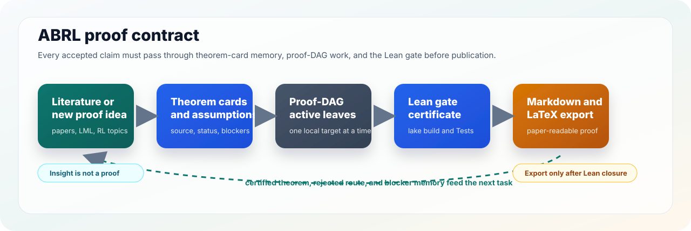
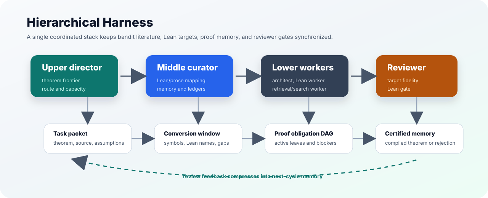
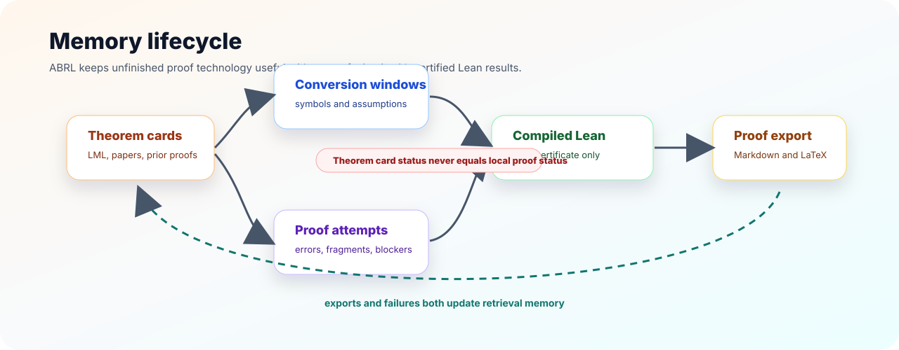

<div align="center">

# Auto-Lean-in-Sleep: Bandit and RL Proofs

<h3 align="center">
A hierarchical multi-agent harness for building Lean-checked bandit and reinforcement-learning proof libraries.
</h3>

[![Lean][Lean-image]][Lean-url]
[![License][License-image]][License-url]

[Lean-image]: https://img.shields.io/badge/Lean-4.29.1-blue?style=flat-square
[License-image]: https://img.shields.io/badge/License-MIT-orange?style=flat-square
[Lean-url]: https://lean-lang.org/
[License-url]: LICENSE

</div>

## News

* **June 25, 2026.** Initial ABRL harness skeleton is live: a Lean package,
  default hierarchical multi-agent workflow, LML theorem-card memory, proof
  obligations, agent skills, and Markdown/LaTeX proof-export protocol.

---

ABRL is a Lean 4 project and multi-agent harness for turning bandit and
reinforcement-learning literature into a maintainable proof library.  Its
first target is classical stochastic bandit theory: finite arms, pull counts,
gap decompositions, Explore-Then-Commit, UCB, Thompson sampling, Bayesian
regret, and the concentration lemmas needed to support those results.

The project is built around one contract:

```text
literature theorem or new bandit/RL proof target
-> theorem card and assumption ledger
-> Lean statement and proof-DAG leaves
-> compiled Lean certificate
-> synchronized Markdown and LaTeX explanation
-> reusable memory for the next theorem
```

Natural-language sketches, theorem cards, simulator checks, and external
answers can guide the search.  They do not become achieved results until the
relevant Lean declarations compile.



## Harness Profile

ABRL intentionally starts with the first ABEIS-style harness profile: one
Hierarchical Harness.  There is no website in this repository.



| Layer | Responsibility | Main artifacts |
| --- | --- | --- |
| Upper | Choose the theorem frontier, route literature results, decide what is blocked. | `tasks/`, `proof-blueprints/`, `runs/*/10_upper_director.md` |
| Middle | Keep Lean, prose, assumptions, theorem cards, and memory synchronized. | `conversion-windows/`, `proof-obligations/`, `research-wiki/` |
| Lower | Prove one proof-DAG leaf, formalize one definition, or write one precise blocker. | `BanditRLProof/`, `proof-attempts/`, `verifier-feedback/` |
| Reviewer | Reject target drift, hidden assumptions, stale leaves, and uncompiled claims. | `reviews/`, `runs/*/40_reviewer.md`, `tools/bandit.py check` |

The lower layer has three recurring specializations: natural-language proof
architect, Lean worker, and retrieval/search worker.  All three operate on the
same task packet and proof-obligation ledger.

## Core Workflow

The core loop is intentionally conservative: retrieve existing theorem cards,
write a narrow proof-DAG leaf, run Lean, then compress the result into memory.
The harness should improve by accumulating reusable proof blocks, not by
letting agents silently change theorem targets.

## Quick Start

```bash
cd Auto-Bandit-RL-Proof-In-Sleep

python3 tools/bandit.py check
python3 tools/bandit.py list-literature
python3 tools/bandit.py next-task
python3 tools/bandit.py reference-index
```

Create a task:

```bash
python3 tools/bandit.py new-task BRL-UCB-PORT-001 \
  --kind literaturePort \
  --title "Port the UCB regret proof route" \
  --target-lean BanditRLProof/Algorithms/UCB.lean

python3 tools/bandit.py blueprint-refresh BRL-UCB-PORT-001
python3 tools/bandit.py run-cycle BRL-UCB-PORT-001 --lower-count 3
```

The mandatory acceptance gate is:

```bash
lake build && lake build Tests
```

`python3 tools/bandit.py check` runs that gate and scans local Lean files for
placeholders such as `sorry`, `admit`, `axiom`, and `postulate`.

## Lean Library Shape

The current Lean package is dependency-light and compiles without Mathlib:

| Path | Purpose |
| --- | --- |
| `BanditRLProof/Core.lean` | finite action traces, pull counts, reward sums, finite mean models |
| `BanditRLProof/Regret.lean` | pseudo-regret surface and theorem-card records |
| `BanditRLProof/Algorithms/ETC.lean` | Explore-Then-Commit proof-DAG surfaces |
| `BanditRLProof/Algorithms/UCB.lean` | UCB index proof-DAG surfaces |
| `BanditRLProof/Algorithms/Thompson.lean` | Thompson sampling and Bayesian regret surfaces |
| `BanditRLProof/Literature.lean` | upstream theorem-card registry |
| `BanditRLProof/Automation.lean` | compiled harness roles, task contracts, gates |
| `BanditRLProof/OpenProblems.lean` | typed open-problem registry |

This is a staged design.  The memory layer records LML and Mathlib-heavy proof
routes now; individual tasks can later decide whether to port theorem fragments
into this package, add Mathlib, or depend on LML once toolchain alignment is
intentional.

## Memory Library

ABRL treats unfinished proof technology as a first-class artifact.  Important
memory files include:

- `research-wiki/lml/theorem-cards.md`: LML declarations and proof-route cards.
- `research-wiki/proof-techniques/classical-bandits.md`: regret and concentration proof patterns.
- `research-wiki/proof-techniques/lean-patterns.md`: Lean formalization patterns for finite actions, kernels, and sums.
- `research-wiki/open-problems/bandit-proof-backlog.md`: unproved or partially mapped proof technology.
- `conversion-windows/` and `proof-obligations/`: task-local Lean/prose correspondence and active proof-DAG leaves.

Only compiled local declarations enter certified memory.  Theorem cards from
upstream libraries stay marked as theorem cards until imported or ported and
build-tested in this repository.



## LML Integration

[LeanMachineLearning/LML][lml] is the primary external Lean reference for this
project.  ABRL uses it for theorem-card memory around:

- stochastic sequential learning interfaces;
- finite action bookkeeping such as pull counts and reward sums;
- generic regret decompositions;
- Explore-Then-Commit regret;
- UCB regret;
- Thompson sampling posterior action and Bayesian regret.

At initialization time, ABRL records the LML declarations in
`BanditRLProof/Literature.lean` and `research-wiki/lml/theorem-cards.md`.
No LML source code is vendored into this repository in the initial skeleton.

## Proof Export

After a theorem compiles, middle/reviewer agents should run:

```bash
python3 tools/bandit.py export-proof TASK_ID --title "Human readable theorem title"
```

The generated `paper-notes/problem-exports/<task-id>/latest.tex` and
`latest.md` are proof-export targets.  They must name the compiled Lean
declarations they translate and must not state stronger claims than Lean
supports.

## Related Work And Similar Patterns

ABRL adapts patterns from adjacent projects while specializing them to bandit
and RL proof libraries.

| Work | Similar pattern | ABRL use |
| --- | --- | --- |
| [ABEIS][abeis] | Hierarchical harness, Lean gate, conversion windows, proof obligations, proof export. | Default upper/middle/lower/reviewer workflow and acceptance rule. |
| [ARIS][aris] | Plain-file autonomous research workflow, skills, reviews, run logs. | Inspectable task packets, research wiki, prompt decks, and local CLI. |
| [Learning Beyond Gradients][lbg] | Iterative system improvement through layered feedback and persistent trial memory. | Trial JSONL, summary CSV, failed-route memory, and upper/middle/lower/reviewer maintenance loops. |
| [EoH][eoh] | Evolutionary search over structured candidate solutions. | Future theorem-route and proof-DAG candidate populations under a fixed Lean-checkable target. |
| [LeanMachineLearning/LML][lml] | Lean formalization of bandit algorithms and regret bounds. | Theorem-card memory and future import/port target. |
| [LeanMarathon][leanmarathon] | Proof blueprint, target review, dynamic leaves, deterministic gates. | Proof-blueprint snapshots and one-leaf lower-agent packets. |
| [lean-stat-learning-theory][lean-slt] | Concentration and empirical-process formalization at ML-theory scale. | Proof-engineering reference for concentration and learning-theory lemmas. |
| [Mathlib][mathlib] | Core Lean mathematical library. | Future probability, measure, asymptotic, and concentration dependencies. |

More detail is in [`docs/attribution.md`](docs/attribution.md) and
[`NOTICE.md`](NOTICE.md).

## Citation

```bibtex
@misc{abrl2026,
  title = {Auto-Lean-in-Sleep: Bandit and RL Proofs},
  year = {2026},
  note = {Lean-checked multi-agent harness for bandit and RL proof libraries}
}
```

[abeis]: https://github.com/DakeBU/Quantum-Computing-Block-Encoding
[aris]: https://github.com/wanshuiyin/Auto-claude-code-research-in-sleep
[lbg]: https://github.com/Trinkle23897/learning-beyond-gradients
[eoh]: https://github.com/FeiLiu36/EoH
[lml]: https://github.com/LeanMachineLearning/LML
[leanmarathon]: https://github.com/YuanheZ/LeanMarathon
[lean-slt]: https://github.com/YuanheZ/lean-stat-learning-theory
[mathlib]: https://github.com/leanprover-community/mathlib4
