# Compiled proof references at `f771f571abf69b4bfd45e78c9358e428ad881a9a`

Selected direct proof-value references; arrow points to a dependency.
Type-only references and external Mathlib references remain in the JSON report.
This is not a teaching graph or a utility score.

```mermaid
flowchart TD
  n0["Concentration.HasMGFUpperBoundAt.measure_ge_le_exp_add"]
  n1["Concentration.exp_le_one_add_self_add_sq_of_abs_le_one"]
  n2["abs_clip_sub_clip_le"]
  n3["abs_sub_truncate_le"]
  n4["abs_truncate_le"]
  n5["actual_clipped_corruption_le"]
  n6["bounded_centered_mgf"]
  n7["clip"]
  n8["clip_corruption_le"]
  n9["clipped_observed_prefix"]
  n10["clipped_prefix_corruption_le"]
  n11["corrupted_clipped_estimator_error_le"]
  n12["estimator_error_le"]
  n13["independent_sum_mgf"]
  n14["integral_sq_truncate_le"]
  n15["integral_truncate_bias_le"]
  n16["measurable_truncate"]
  n17["prefixMean"]
  n18["sq_truncate_le"]
  n19["sq_truncate_le._simp_1_1"]
  n20["transformed_observed_prefix"]
  n21["truncate"]
  n22["truncate.eq_1"]
  n23["truncate_not_unit_lipschitz"]
  n24["truncated_centered_mgf"]
  n25["truncated_sum_tail"]
  n26["UCB.sumRewards_rewardFromArmStream_eq_armPrefixSum"]
  n2 -->|"type+value"| n7
  n3 -->|"type+value"| n21
  n4 -->|"type+value"| n21
  n5 -->|"type+value"| n7
  n5 -->|"value"| n9
  n5 -->|"value"| n10
  n5 -->|"value"| n20
  n6 -->|"value"| n1
  n8 -->|"value"| n2
  n8 -->|"type+value"| n7
  n9 -->|"type+value"| n7
  n9 -->|"value"| n20
  n10 -->|"type+value"| n7
  n10 -->|"value"| n8
  n10 -->|"type+value"| n17
  n11 -->|"type+value"| n7
  n11 -->|"value"| n10
  n11 -->|"value"| n12
  n11 -->|"type+value"| n17
  n14 -->|"value"| n16
  n14 -->|"value"| n18
  n14 -->|"type+value"| n21
  n15 -->|"value"| n3
  n15 -->|"type+value"| n21
  n18 -->|"value"| n19
  n18 -->|"type+value"| n21
  n20 -->|"value"| n26
  n22 -->|"type+value"| n21
  n23 -->|"type+value"| n21
  n24 -->|"value"| n4
  n24 -->|"value"| n6
  n24 -->|"value"| n14
  n24 -->|"value"| n16
  n24 -->|"type+value"| n21
  n25 -->|"value"| n0
  n25 -->|"value"| n13
  n25 -->|"value"| n16
  n25 -->|"type+value"| n21
  n25 -->|"value"| n24
  classDef frozen fill:#e2e8f0,stroke:#475569
  class n0 frozen
  class n1 frozen
  class n26 frozen
```

Raw compiled graph SHA-256: `d2c5bd245080f04e610a71204589c1bf204414d00ef66ef226447c203678b960`.
