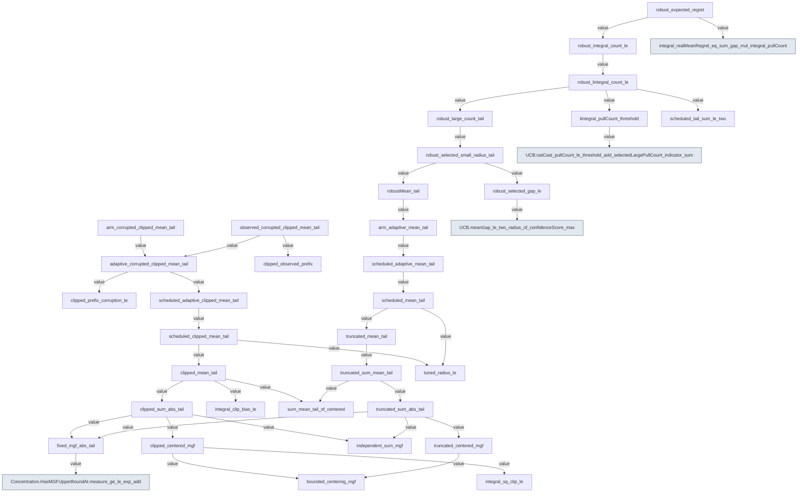

# Compiled proof references at `ae3e6571fd39c4730d59dbc38466f9211bad2cce`

Selected direct proof-value references; arrow points to a dependency.
Type-only references and external Mathlib references remain in the JSON report.
This is not a teaching graph or a utility score.

Raw compiled graph SHA-256: `c71bb8531d0ae22f9102d94ae3414f0988a0066d3d5a56fa5b399b5c3ecc6516`.
