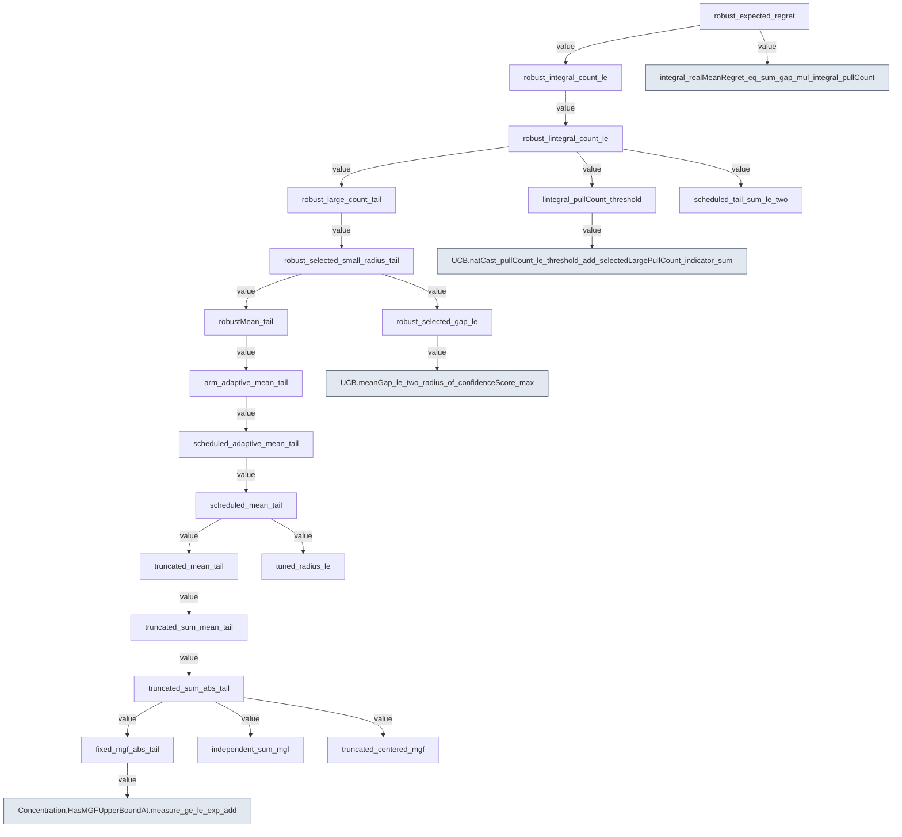

# Compiled proof references at `280378670ca4647440f795aae1905149eff0063b`

Selected direct proof-value references; arrow points to a dependency.
Type-only references and external Mathlib references remain in the JSON report.
This is not a teaching graph or a utility score.

Raw compiled graph SHA-256: `40a228cfca9ce30a98a0d7af5eb16aa22f62e0759ae57e2f383f8566e394e973`.
