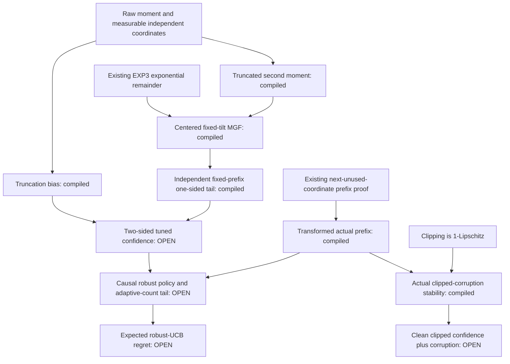

# Obligation graph (mathematical workflow, not elaborated dependencies)

Exact compiled type/value references are emitted separately by
`tools/extended_topics_evidence.py`. This diagram does not assert that a source
arrow is a Lean proof-term dependency. It also does not infer completion of the
endpoint from compiled predecessor leaves.

The shared `.lake/packages` junction points to canonical pinned dependencies;
the worktree has its own `.lake/build`. This development setup is allowed for
proof work but is explicitly unsuitable for a Mathlib-only isolation experiment.
