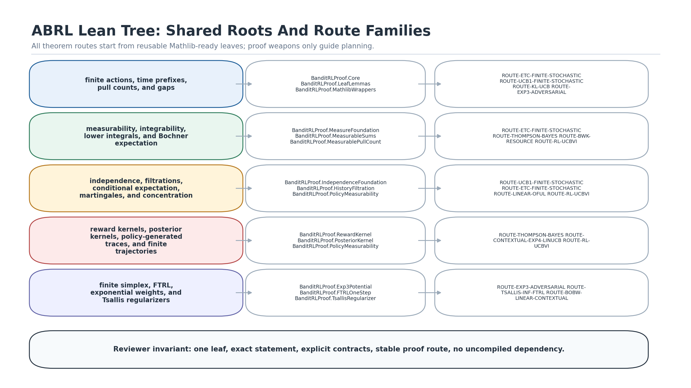
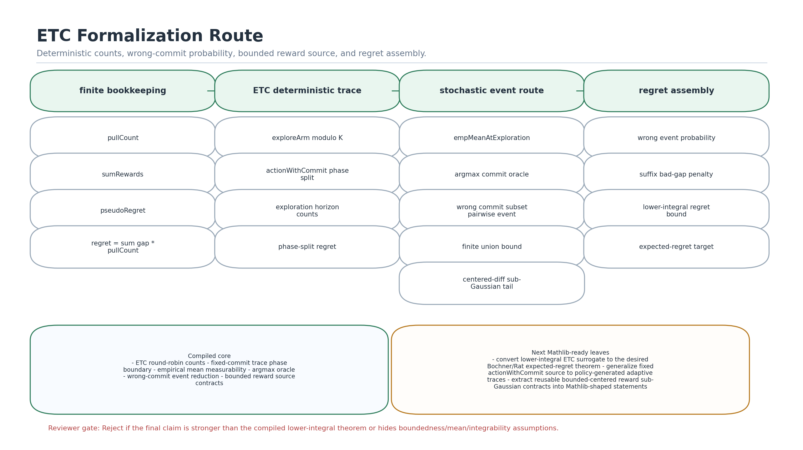
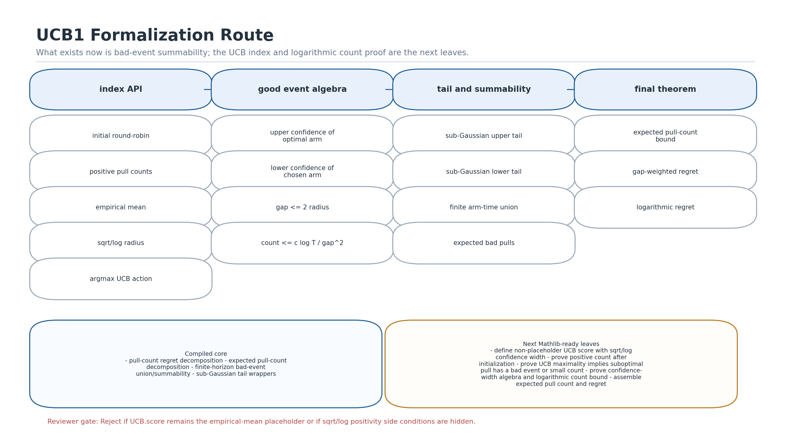
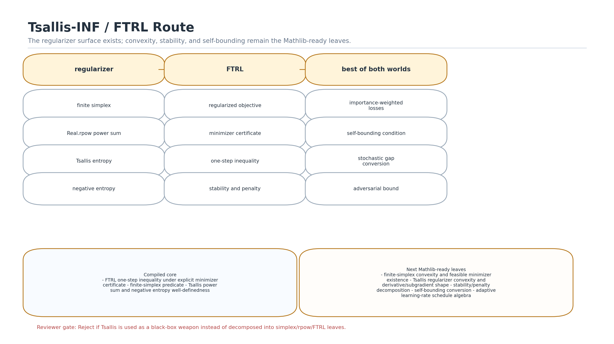
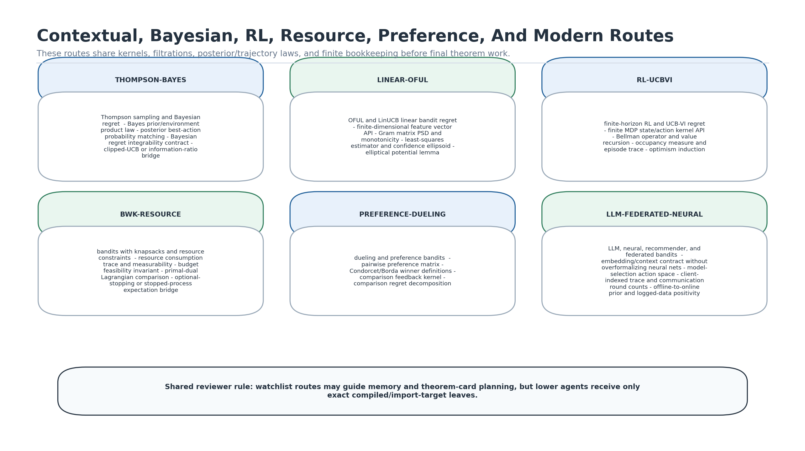
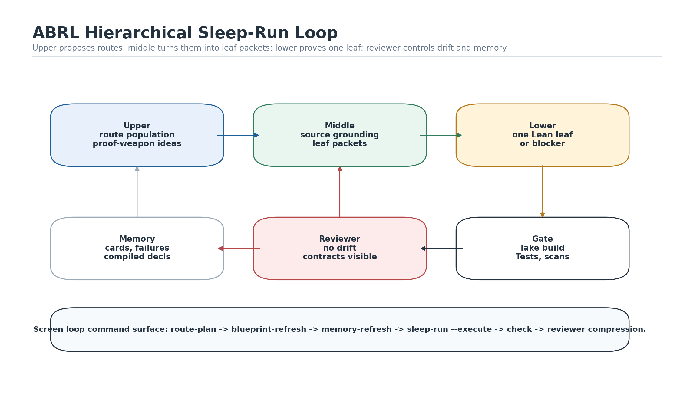

# Full Lean Tree Roadmap

This document is the reader-facing companion to
`research-wiki/theory-tree/lean-route-roadmap.json`.  The JSON file is the
machine-readable plan used by agents; this document explains why the tree is
large, how to read it, and how reviewer agents should judge progress.

## Why So Many Leaves

It is normal that ABRL still needs many small local Lean lemmas even after
recording LML theorem cards, lean-stat-learning-theory inspiration, and Mathlib
retrieval routes.

First, upstream theorem cards rarely have the exact local API.  LML may contain
a UCB or ETC theorem route, but ABRL still needs adapters for its own action
traces, reward traces, finite model record, source contracts, and export
surface.  A theorem card is a route, not a compiled local dependency, until it
is imported or ported.

Second, Mathlib gives general mathematics, not bandit glue.  Mathlib can supply
finite sums, kernels, conditional expectation, sub-Gaussian tails, martingales,
convexity, and real analysis, but ABRL must still prove the bridge lemmas that
connect those APIs to bandit objects: pull counts, empirical means, selected
reward events, history filtrations, posterior kernels, UCB indices, FTRL
objectives, and regret decompositions.

Third, a Mathlib-ready style increases the number of leaves by design.  Hidden
regularity should be turned into reusable contracts, so instead of proving a
large algorithm theorem with implicit measurability/integrability/boundedness
assumptions, ABRL exposes those assumptions as named leaves that can be reused
by ETC, UCB, Thompson sampling, contextual bandits, and RL.

The goal is not to prove many tiny lemmas for their own sake.  The goal is to
make every future theorem route searchable, auditable, and portable to Mathlib
where the statement is general mathematics.

## Global Tree



Every route starts from shared leaves:

| Shared spine | What it contributes | Example downstream routes |
| --- | --- | --- |
| Finite bookkeeping | finite arms, traces, pull counts, gaps, regret decomposition | ETC, UCB, KL-UCB, EXP3, Tsallis-INF |
| Measure and expectation | measurability, integrability, lower integrals, Bochner expected regret | ETC, Thompson sampling, BwK |
| Concentration | independence, filtrations, conditional expectation, martingales, sub-Gaussian and variance tails | ETC, UCB, OFUL, RL |
| Kernel/posterior | reward kernels, posterior kernels, policy-generated traces, finite trajectory laws | Thompson, contextual, RL |
| Optimization | finite simplex, FTRL, exponential weights, Tsallis regularizers | EXP3, Tsallis-INF, BoBW contextual |

Reviewer rule: a lower agent receives one leaf, not an entire route.  Middle
must write the exact Lean statement, local APIs, intended proof route,
regularity contracts, Mathlib/LML/local retrieval evidence, and failure policy
before the lower worker starts.

## ETC Route



ETC is currently the most advanced local route.  The compiled core already
contains deterministic round-robin counts, fixed-commit phase splitting,
empirical mean measurability, argmax commit oracle, wrong-commit probability
wrappers, bounded reward source contracts, infinite product source wrappers,
and an `ENNReal.ofReal` lower-integral regret assembly.

The next leaves are:

| Leaf group | Why it matters | Reviewer standard |
| --- | --- | --- |
| Expected-regret conversion | Turn the current lower-integral surrogate into the desired Bochner/Rat expected-regret theorem. | Do not claim a stronger theorem than the compiled lower-integral statement. |
| Adaptive source generalization | Move from fixed `actionWithCommit` product-coordinate sources to policy-generated adaptive traces. | Policy predictability and trajectory-law identification must be explicit. |
| Mathlib-ready bounded-source contracts | Extract bounded centered reward, exact mean, and conditional sub-Gaussian assumptions as reusable theorem contracts. | No hidden integrability, measurability, or boundedness. |

## UCB Route



UCB currently has useful shared leaves, but not the full UCB theorem.  The
compiled local core includes pull-count/regret decompositions, expected
pull-count decomposition, finite-horizon bad-event summability, and
sub-Gaussian tail wrappers.  The local `UCB.score` surface is still a thin
placeholder, so the next work is genuinely foundational.

The UCB route should be decomposed as:

| Stage | Leaf targets |
| --- | --- |
| Index API | initialization, positive pull counts, empirical mean, non-placeholder sqrt/log radius, argmax index action |
| Good-event algebra | optimal-arm confidence, chosen-arm confidence, `gap <= 2 * radius`, count threshold |
| Tail route | upper/lower empirical-mean tails, arm-time union, bad-event summability |
| Regret | expected pull-count bound, gap-weighted regret, logarithmic final statement |

Reviewer must reject a UCB proof that hides positivity of logarithms,
square-root arguments, denominator nonzero facts, or the initial positive-count
phase.

## Tsallis-INF And FTRL Route



The compiled local surface defines finite-simplex FTRL one-step inequalities
and Tsallis regularizer well-definedness.  This is intentionally below the
full Tsallis-INF theorem.

The next Mathlib-ready leaves are:

| Leaf group | Target |
| --- | --- |
| Simplex infrastructure | finite-simplex convexity, nonempty feasibility, minimizer/existence contracts |
| Tsallis algebra | rpow monotonicity, convexity/subgradient shape, stability and penalty terms |
| Bandit estimator | importance-weighted losses, positivity of sampling probabilities, unbiasedness |
| BoBW conversion | self-bounding condition, stochastic gap conversion, adversarial regret branch |

Proof weapons such as Tsallis-INF/FTRL can generate route ideas, but lower
agents must prove the individual simplex, rpow, FTRL, estimator, and
self-bounding leaves.

## Contextual, Bayesian, RL, Resource, Preference, And Modern Routes



These routes are wider and should be treated as structured watchlist routes
until their first exact theorem targets are chosen.

| Route | Shared roots | First concrete leaves |
| --- | --- | --- |
| Thompson/Bayesian | posterior kernels, posterior-action identity ledger, finite/countable best-action measurability, conditional expectation, expected regret | prior/environment law, posterior action-law construction/import, noncountable best-action measurability if needed, Bayesian regret integrability |
| Linear/OFUL | linear algebra, martingale concentration, finite regret | feature-vector API, Gram matrix PSD/monotonicity, ellipsoid confidence, elliptical potential |
| RL/UCB-VI | kernels, finite trajectories, Bellman recursion | finite MDP API, value recursion, occupancy measure, episode regret telescope |
| BwK/resource | budget stopping time, finite sums, expectation | resource trace, budget feasibility, primal-dual comparison |
| Dueling/preference | finite pairs, preference kernels, tails | pairwise preference matrix, Condorcet/Borda definitions, comparison regret |
| LLM/federated/neural | contextual policies, posterior/priors, distributed traces | embedding/context contracts, model-selection action space, client trace, communication count |

Modern watchlist cards include BoBW linear contextual bandits, LC-Tsallis-INF,
LLM-generated priors for contextual bandits, and LLM/bandit survey routes.
These are source cards for planning and scenario coverage; they are not proof
dependencies until a compiled/imported Lean theorem exists.

## Agent Loop



The intended automation loop is:

```bash
python3 tools/bandit.py list-routes
python3 tools/bandit.py route-plan ROUTE-UCB1-FINITE-STOCHASTIC --with-commands
python3 tools/bandit.py unfinished
python3 tools/bandit.py blueprint-refresh BRL-UCB-PORT-001
python3 tools/bandit.py memory-refresh BRL-UCB-PORT-001
python3 tools/bandit.py sleep-run BRL-UCB-PORT-001 \
  --cycles 2 \
  --lower-count 4 \
  --execute \
  --agent-profile codex-parallel.example.json \
  --check-each-cycle \
  --stop-on-error
python3 tools/bandit.py check
```

For a collaborator using `screen`, generate a command packet with:

```bash
python3 tools/bandit.py screen-plan BRL-UCB-PORT-001 \
  --route ROUTE-UCB1-FINITE-STOCHASTIC \
  --cycles 2 \
  --lower-count 4
```

## Reviewer Checklist

Reviewer agents should reject a cycle when any of the following happens:

| Failure mode | Required response |
| --- | --- |
| The theorem target changed silently. | Stop and require a middle-layer route-change note. |
| A proof weapon is cited as a dependency. | Replace it with compiled declarations, imported Mathlib, or theorem-card status. |
| Hidden regularity is buried in prose. | Create named contracts for measurability, integrability, nonemptiness, boundedness, positivity, summability, or adaptedness. |
| A lower worker repeatedly fails on the same leaf. | Treat it as mathematical signal: audit the statement, missing assumptions, or counterexample. |
| The final prose is stronger than Lean. | Downgrade the claim or add the missing theorem leaf. |
| A general-purpose theorem is project-local only. | Mark it as Mathlib candidate and keep the local wrapper thin. |

## Route Commands

Use the structured roadmap directly:

```bash
python3 tools/bandit.py list-routes
python3 tools/bandit.py list-routes --priority active-next
python3 tools/bandit.py route-plan ROUTE-ETC-FINITE-STOCHASTIC
python3 tools/bandit.py route-plan ROUTE-UCB1-FINITE-STOCHASTIC --json
python3 tools/bandit.py screen-plan BRL-UCB-PORT-001 --route ROUTE-UCB1-FINITE-STOCHASTIC
```

The route map is intentionally larger than the current Lean package.  Branches
without compiled local declarations remain theorem-card, paper-card,
Mathlib-route, or watchlist memory until a task imports, ports, or proves the
needed leaves.
