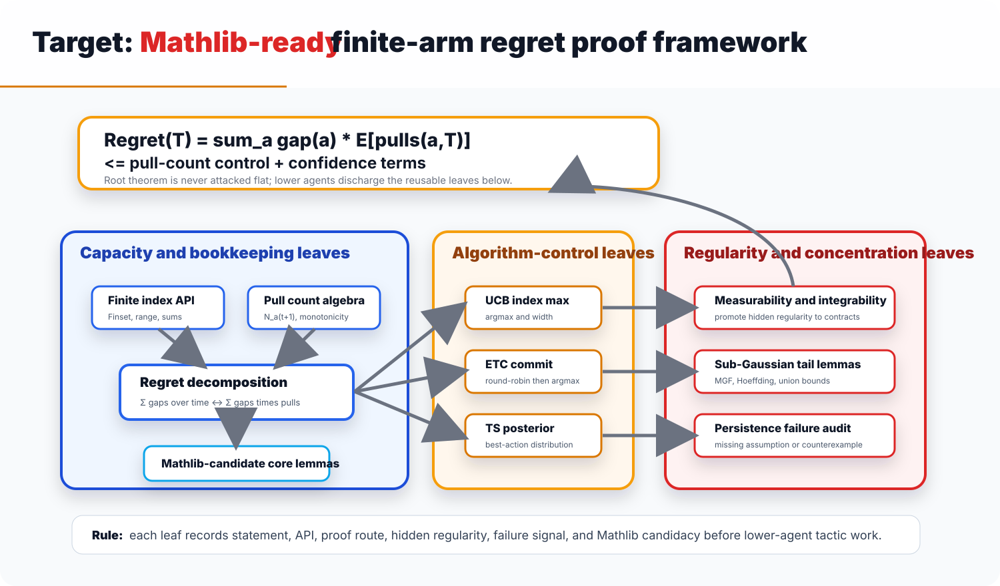
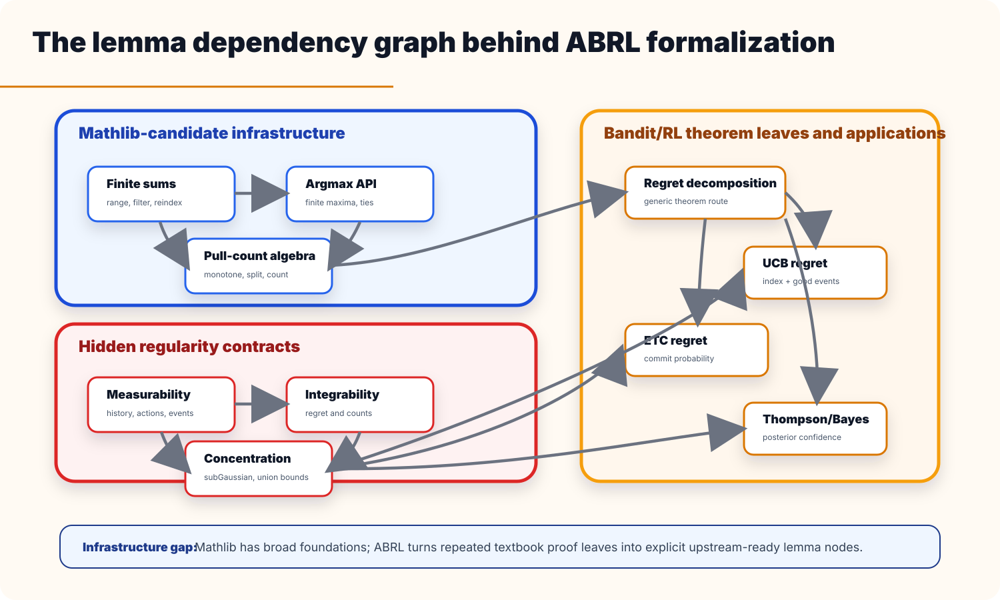
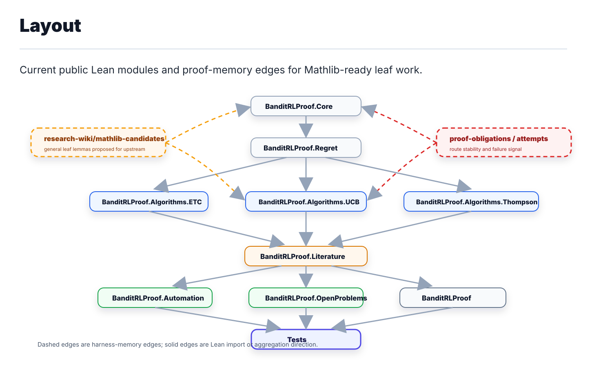

# Lean Lemma Leaf Network

ABRL uses three public diagrams to keep the proof architecture inspectable.
They are working diagrams for agents, not presentation-only assets.

The current full route atlas is split into PNG diagrams so each theorem family
can be inspected without crowding.

ETC is the most developed local route, ending currently at lower-integral
regret assembly.

UCB has summability/tail consumers but still needs the index and logarithmic
pull-count proof.

The finite-simplex and Tsallis/FTRL regularizer surfaces exist; stability,
self-bounding, and learning-rate optimization remain future leaves.

The wider contextual, Bayesian, RL, resource, preference, and modern routes
share kernels, filtrations, posterior laws, and finite bookkeeping before final
theorem work.

The machine-readable source for these diagrams is
`research-wiki/theory-tree/lean-route-roadmap.json`; regenerate the PNG assets
with `python3 tools/bandit.py render-roadmap-assets`.

## Framework

The framework starts from a bandit or RL theorem target and forces the task
packet to expose:

- the Lean statement and source theorem;
- local APIs and imports;
- the intended proof route;
- hidden regularity contracts;
- Mathlib candidacy for every general-purpose leaf;
- synchronized Markdown and LaTeX export after compilation.

Lower agents should only receive a leaf after these fields are written.

## Dependency Graph

The graph separates four kinds of proof work:

- foundational Lean APIs such as finite sums, order facts, nonempty instances,
  boundedness, measurability, and integrability;
- concentration and posterior infrastructure;
- bandit wrappers for pull counts, gaps, regret, confidence indices, and
  posterior actions;
- final theorem surfaces such as ETC, UCB, Thompson sampling, and RL regret.

The leaf standard is deliberately small.  A node should fit in one lower-agent
context window, have a stable proof route, and be reviewed before a route
pivot.  Persistent failure is mathematical signal: audit the statement,
missing assumptions, or counterexample before more tactic search.

## Module Layout

The module layout mirrors the dependency graph.  The current compiled core is
dependency-light.  Mathlib-heavy probability, concentration, posterior, RL,
and asymptotic modules are staged as explicit proof obligations until a task
decides to import, port, or upstream the needed theorem.

## Leaf Record

Every active leaf in `proof-obligations/` should include:

| Field | Rule |
| --- | --- |
| Target | Exact Lean statement or declaration name. |
| Local APIs/imports | Existing declarations expected to solve the leaf. |
| Intended proof route | Stable plan; do not change it frequently. |
| Regularity contracts | Integrability, continuity, measurability, nonemptiness, boundedness, finiteness, positivity, summability, or adaptedness. |
| Mathlib status | `mathlib-candidate`, `project-local`, or `theorem-card-only`. |
| Failure signal | If repeated attempts fail, record the mathematical diagnosis. |

General leaf lemmas should be stated in a form that can plausibly become
Mathlib material.  ABRL-specific wrappers should stay thin and should point to
the reusable lemmas they depend on.
