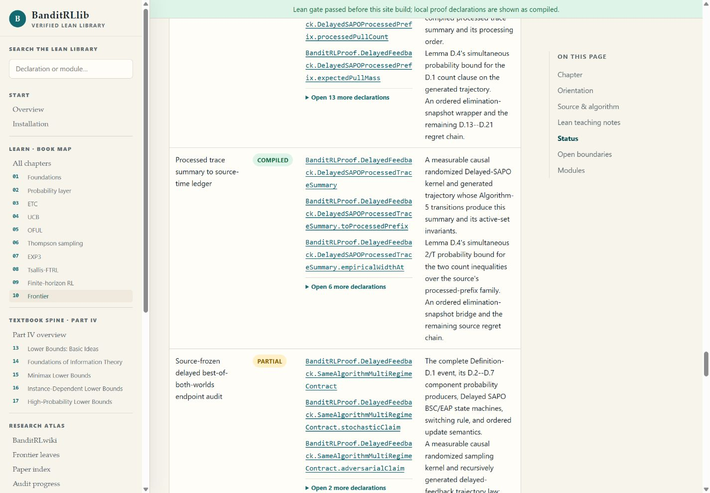
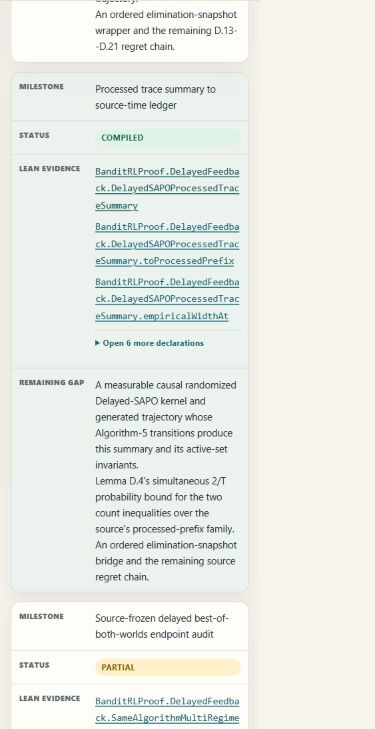

# Frontier processed-trace-summary visual QA

Date: 2026-08-25

Source build: local `website/_site`, generated with
`python -B website/scripts/build_site.py --lean-verified` from the isolated
candidate worktree based on `df138dc1edf68c9d47be53cc7639872350d39747`.
The candidate is intentionally marked dirty until its reviewed commit is
published; deployment is verified separately after merge.

## Desktop: 1440 x 1000

- The current `10 Frontier` navigation state is visible.
- `Processed trace summary to source-time ledger` is labelled `COMPILED`,
  while the delayed best-of-both-worlds endpoint remains `PARTIAL`.
- The page has no horizontal overflow (`scrollWidth = clientWidth = 1425`).
- The milestone row's four cells report no local overflow. Long fully qualified
  Lean names wrap within the evidence column.
- The default view lists three declarations and exposes six more through a
  native disclosure, keeping the evidence inspectable without overwhelming the
  reading path.

## Mobile: 390 x 844

- The document has no horizontal overflow (`scrollWidth = clientWidth = 375`
  after the browser scrollbar is accounted for).
- The row becomes a labelled card and keeps `MILESTONE`, `STATUS`,
  `LEAN EVIDENCE`, and `REMAINING GAP` as separate fields.
- Long declaration names wrap within the card. The compiled adapter and the
  open Algorithm-5 transition-and-invariant-to-summary, D.4 `2/T`, trajectory,
  ordered-elimination, and terminal-regret obligations remain visually distinct.
- The navigation trigger is a native button with
  `aria-controls="site-sidebar"`. Activating it changes `aria-expanded` from
  `false` to `true`; `Escape` restores `aria-expanded="false"`,
  `aria-hidden="true"`, and moves the drawer off-screen.

## Result

PASS for the inspected desktop and narrow-screen layouts. This is layout and
interaction evidence only; it does not replace the Lean, declaration-index,
link, formula, Mermaid, CI, or live-deployment gates.
