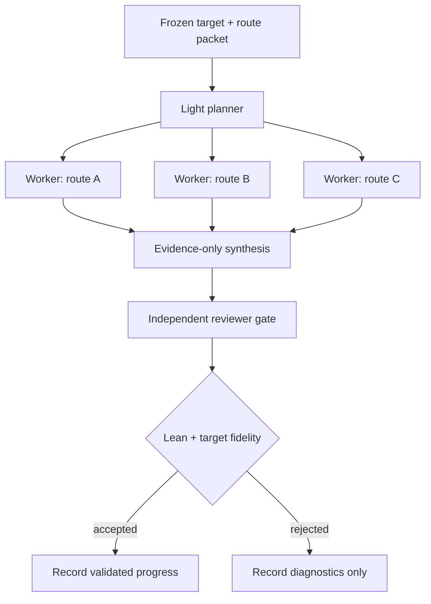

# GPT Harness Review

This checked-in review preserves the substantive model output; local CLI cache
compatibility diagnostics from stderr are omitted because they are not harness
evidence.

The deterministic report does not support choosing a winner. There are `0`
matched experiments, below the required `2`, and the only eligible recent row
is an unmatched `master-worker` run. Its compiled leaf is useful evidence for
that run, but it cannot be used as primary comparative evidence against
`hierarchical`.

## Comparison

- **Progress:** matched progress is tied at zero. The unmatched
  `master-worker` row reports one compiled leaf with four new declarations and
  several reused declarations, but it has no reviewer-owned verdict.
- **Context cost:** matched prompt/token evidence is zero for both arms, so no
  cost comparison is available.
- **Critical path:** matched critical-path seconds are zero for both arms, so
  no timing comparison is available.
- **Duplication:** no matched route-level evidence exists.
- **Failure diagnosis:** the excluded `sgb-t2-round33-master-worker` experiment
  lacks a paired hierarchical arm.

## Strongest supported pattern

Keep the current default, then test reviewer-gated bounded parallel exploration
under the same frozen target, route-packet hash, and acceptance rule. This is a
hypothesis for a matched experiment, not an adopted default.



```json
{
  "recommended_default": "retain-current-default",
  "confidence": "low",
  "evidence": [
    "Deterministic decision status is insufficient-evidence.",
    "Minimum matched experiments required is 2; found 0.",
    "Matched evidence reports zero experiments, attempts, reviewed attempts, obligations closed, declarations, and substantive score for both harnesses.",
    "One unmatched master-worker run reports a compiled leaf with four new declarations and reused declarations, but it is excluded because the paired hierarchical arm and reviewer-owned verdict are absent."
  ],
  "risks": [
    "Adopting master-worker now would overfit to an unmatched, unreviewed success signal.",
    "Adopting hierarchical as empirically superior would also be unsupported because it has no matched execution.",
    "A hybrid can create a master bottleneck unless synthesis stays narrow and reviewer gating remains independent."
  ],
  "next_matched_experiment": {
    "target": "PAPER-AUDIT-NEURIPS-2025-SGB-PHASE-TRANSITION-PROSPECTIVE",
    "route_packet": "Use the same frozen route packet for both arms.",
    "arms": [
      "hierarchical",
      "master-worker"
    ],
    "matching_requirements": [
      "same experiment id",
      "same target fingerprint",
      "same frozen route-packet hash",
      "separate reviewer-owned verdict for each execution attempt"
    ],
    "primary_metric": "reviewer-validated substantive mathematical progress"
  },
  "proposed_change": "No scheduler default change. Test a light planner, bounded disjoint workers, evidence-only synthesis, and an independent reviewer as the master-worker arm of the next matched experiment."
}
```
